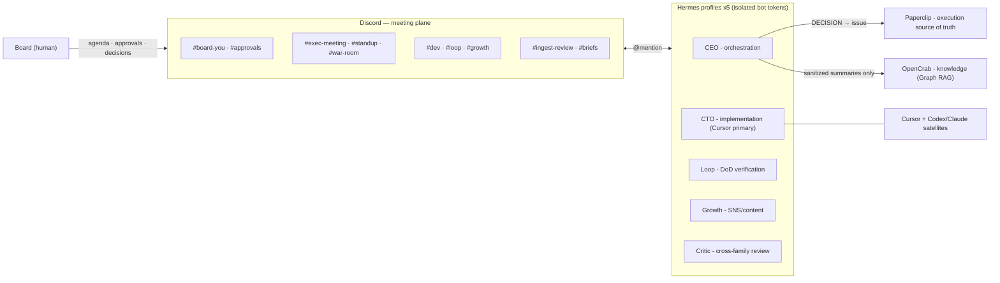

# AI Company Discord

**Discord-first control room for a one-person AI company.**

Each executive (CEO, CTO, Loop, Growth, Critic) runs as an isolated [Hermes](https://github.com/NousResearch/hermes-agent) profile with its own `SOUL.md`, memory, and **Discord bot token**. You sit on the Board; agents meet in Discord threads, ship work through [Paperclip](https://github.com/paperclipai/paperclip), and store sanitized knowledge in [OpenCrab](https://opencrab.sh) via [workmate-opencrab-ingest](https://github.com/contentscoin/workmate-opencrab-ingest-skill).

Telegram is optional **DM hotline only**. Multi-agent meetings default to Discord (history + per-bot identity).

Role routing follows the spirit of [GJC multivendor setup](https://github.com/project820/gjc-multivendor-setup-guide): strong orchestrator + signal-based delegation + cross-family critic.

## Stack

| Layer | Tool |
|-------|------|
| Meeting / souls | Discord + Hermes profiles |
| Org / tasks / budgets | Paperclip |
| Dev center | **Cursor** (+ Codex / Claude satellites) |
| Product framework (optional) | [akanjs](https://github.com/akan-team/akanjs) — full-stack TS, candidate |
| Knowledge | OpenCrab + Workmate ingest |
| Model routing (optional) | GJC `daily` / `coding-sprint` / `cyber-cop` |

> **Dev center vs product framework** — Cursor/Codex/Claude are the coding *agents*; a product framework is what they build *in*. If the company ships full-stack TypeScript, [akanjs](https://github.com/akan-team/akanjs) (Bun+React+SQLite, schema-as-source-of-truth codegen, AI-agent guideline generation) is a candidate. Not mandated — the stack choice is a CEO/Board decision.

## Architecture



## Quick start

```bash
git clone https://github.com/contentscoin/ai-company-discord.git
cd ai-company-discord
./scripts/scaffold-profiles.sh
```

1. Create **five** Discord applications (one bot per soul) — see [SETUP.md](./SETUP.md)
2. Put each `DISCORD_BOT_TOKEN` in `~/.hermes/profiles/<name>/.env`
3. Create channels from [CHANNELS.md](./CHANNELS.md)
4. Start gateways:

```bash
hermes -p ceo gateway start
hermes -p cto gateway start
hermes -p loop gateway start
hermes -p growth gateway start
hermes -p critic gateway start
```

5. Smoke-test in `#exec-meeting`: `@CEO @CTO 주간회의 테스트`

## Docs

| Doc | Contents |
|-----|----------|
| [SETUP.md](./SETUP.md) | Discord apps, Hermes, smoke tests |
| [CHANNELS.md](./CHANNELS.md) | Categories, permissions, mention rules |
| [ROUTING.md](./ROUTING.md) | GJC roles ↔ executives ↔ Cursor |
| [MEETINGS.md](./MEETINGS.md) | Exec meeting / standup protocols |
| [PROTOCOLS.md](./PROTOCOLS.md) | Machine-readable DECISION / VERDICT / PASS-FAIL specs (PROTOCOL v1) |
| [ROADMAP.md](./ROADMAP.md) | Enhancement roadmap (phases 1–4, upstream boundaries) |
| [TROUBLESHOOTING.md](./TROUBLESHOOTING.md) | Symptom → cause → fix tables |
| `profiles/*/SOUL.md` | Independent souls |
| `templates/company.discord.json` | Machine-readable company template |

## Why not Telegram for meetings?

Same bot token looks like one person; Bot API has no channel history; bot↔bot chat is fragile. Profiles alone do not create independent group conversations. Use Discord for the room, Telegram DM only if you want a pocket pager.

## License

MIT — see [LICENSE](./LICENSE).

Upstream projects keep their own licenses (Hermes, Paperclip, GJC guide, OpenCrab, etc.).
