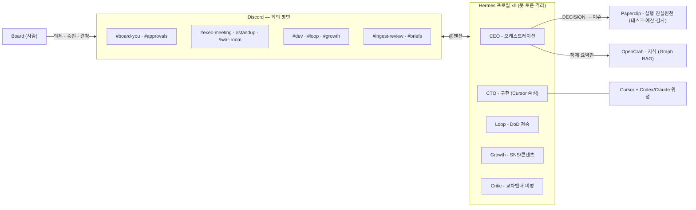

# 고도화 로드맵 (Enhancement Roadmap)

v0.1.0(문서 + 최소 스캐폴드)을 **실제 운영 가능한 컨트롤룸**으로 끌어올리는 단계별 기획서입니다.
버전 목표: Phase 1 = `0.2.0` → Phase 2 = `0.3.0` → Phase 3 = `0.4.0` → Phase 4 = `0.5.0`.

## 1. 현황 진단

| # | 격차 | 현재 상태 |
|---|------|-----------|
| 1 | 수동 운영 | 채널·역할 생성 손 클릭, standup cron 미제공, DECISION→Paperclip 수동, ingest 스테이징 수동 |
| 2 | 단일 진실원천(SSoT) 부재 | `templates/company.discord.json`을 아무것도 소비하지 않음 — scaffold는 프로필 목록 하드코딩, 채널은 [CHANNELS.md](./CHANNELS.md) 산문 보고 수작업 |
| 3 | 검증·헬스 도구 부재 | 토큰 충돌·권한·설정 드리프트를 확인할 수단 없음 |
| 4 | 관측성 부재 | 회의 아카이브·결정 로그 미러·비용 가시성 없음 |
| 5 | 프로토콜 산문 전용 | DECISION 블록·Critic verdict·standup 포맷이 기계 파싱 불가능한 서술로만 존재 |
| 6 | Windows 패리티 격차 | scaffold가 bash 전용 |
| 7 | 온보딩 마찰 | Discord 앱 5개 수작업 생성, 권한 체크리스트 수작업 |

## 2. 설계 원칙

1. **경량 패키지 유지** — docs + templates + scripts. 상주 서비스·봇 리스너를 이 레포에 추가하지 않음
2. **업스트림은 통합만** — Hermes·Paperclip·OpenCrab·GJC를 포크하거나 재구현하지 않음 (→ §3 업스트림 경계)
3. **`company.discord.json` = SSoT** — 역할·채널·회의 정의는 이 파일 하나에서. 스크립트·문서가 이를 소비
4. **시크릿·채널 ID는 레포 밖** — 토큰은 `.env`, 런타임 상태(채널 map·결정 로그)는 `~/.hermes/ai-company/` 이하
5. **평면 분리 유지** — Discord = 회의, Paperclip = 실행 진실원천, OpenCrab = 정제 지식만
6. **스크립트 런타임 Python 3 (stdlib 전용)** — `pip install` 0개, 크로스플랫폼이라 Windows 패리티를 구조적으로 해결. bash/ps1은 3줄 래퍼만
7. **단일 CLI** — 느슨한 스크립트 9개 대신 `scripts/companyctl.py` 하나에 서브커맨드(`validate` `scaffold` `bootstrap` `doctor` `standup` `decision` `lint` `digest` `archive`)를 단계별 추가. 멀티 컴퍼니는 `--config <path>` 플래그로 처음부터 흡수

## 3. 업스트림 경계 — 무엇을 위임하고 무엇을 직접 만드나

이 레포는 Hermes(직원 런타임)·Paperclip(회사 거버넌스)과 경쟁하지 않습니다.
그 둘 위에 얹는 **조직 설계 + 회의 규범 + 배치도** 계층입니다.

| 관심사 | Hermes | Paperclip | 이 레포 |
|--------|--------|-----------|---------|
| 에이전트 구동 (프로필·SOUL·메모리·게이트웨이) | ✅ | — | 위임 |
| 멀티플랫폼 (Discord/TG/Slack) | ✅ | — | 위임 + Discord를 회의 평면으로 지정 |
| cron·스케줄링 | ✅ 내장 스케줄러 | ✅ Routine/heartbeat | 위임 (템플릿만 제공) |
| 태스크·이슈·차단 의존성 | — | ✅ | 위임 (실행 진실원천) |
| 조직도·역할·보고라인 | — | ✅ | **구체화** — 5역할 프리셋 + SOUL 콘텐츠 |
| 예산·비용 추적 | — | ✅ 에이전트/모델별 | 위임 |
| 승인 게이트·감사 로그 | — | ✅ | 위임 + `#approvals` 채널로 표면화 |
| 회의 오케스트레이션 (Council·War Room·standup 프로토콜) | — | — | ✅ **고유 가치** |
| 게이트웨이 기동·감시·서비스 등록 | ✅ `gateway run`/`install`/`list`/`status` — **프로필별로 이미 제공** | 자기 프로세스만 | 5개 팬아웃만 (§3.2) |
| 멘션·cascade 규칙, cross-family Critic 관례 | — | — | ✅ **고유 가치** |
| 역할↔모델 라우팅 규범 (GJC 매핑) | 모델 스위칭만 | 비용 추적만 | ✅ **고유 가치** |
| 지식 정제 파이프라인 (OpenCrab ingest 규범) | — | — | ✅ **고유 가치** |

이에 따른 로드맵 조정 (재발명 방지):

- **Standup cron (Phase 2.3)**: Hermes **내장 cron 스케줄러가 1급 경로** — 이 레포는 프롬프트·설정 템플릿만 제공. `companyctl standup post`(REST 게시)는 Hermes cron을 쓸 수 없는 환경의 fallback으로만
- **결정 로그 (Phase 3.4)**: 감사 추적의 진실원천은 Paperclip. 로컬 `decisions.ndjson`은 **Paperclip 미가동/오프라인에서도 `#briefs` 다이제스트를 뽑기 위한 경량 미러**로만 정당화
- **비용 (Phase 4.2)**: Paperclip 예산·비용 추적이 정답. `COSTS.md`는 **Paperclip 미사용자를 위한 최소 안내**로 한정 — 자체 추적 로직을 만들지 않음

### 3.1 경계선 수정 — 생명주기는 위임 대상이 아니었다

초판의 이 절은 경계를 **한 칸 보수적으로** 그었습니다. cron을 Hermes에, 태스크·비용을 Paperclip에 위임한 것은 옳았지만(확인: Hermes에 내장 cron 스케줄러가 있고 Paperclip은 `:3100`에 API를 띄움), **기동·감시·정지까지 암묵적으로 "사용자 손"에 넘겨** 버렸습니다.

문제는 그 일을 업스트림 누구도 하지 않는다는 것입니다. Hermes는 게이트웨이 **1개**를 실행하고, Paperclip은 자기 프로세스만 압니다. 5-프로필 회사를 한 번에 켜고, 죽은 게이트웨이를 알아채고, 다시 세우는 일은 **이 레포의 몫**입니다. 그 결과 v0.5.0까지도 README는 터미널 5개에 `hermes -p … gateway start`를 치라고 안내했고, 게이트웨이가 죽어도 아무도 되살리지 않았으며, 업스트림 버전은 고정되지 않았습니다.

수정된 경계 — **"포크 금지"와 "생명주기 위임"은 다른 얘기입니다**:

| 오해 | 실제 |
|------|------|
| 업스트림을 건드리지 않는다 = 소스를 복사하지 않는다 | ✅ 유지 (Phase 5도 벤더링하지 않음) |
| 업스트림을 건드리지 않는다 = 실행도 사용자 몫 | ❌ 폐기 — 조합·기동·감시는 이 레포 책임 |

참고로 **Hermes·Paperclip 모두 MIT**라 벤더링이 법적으로는 가능합니다. 그럼에도 하지 않는 이유는 라이선스가 아니라 **유지보수**입니다: 활발히 개발되는 코드베이스 두 개를 떠안으면 업그레이드가 머지 충돌이 되고, 낡은 업스트림을 배포하게 됩니다. 대신 **핀된 ref에서 빌드**해 업그레이드를 한 줄 변경으로 유지합니다.

### 3.2 재수정 — Hermes는 생명주기를 이미 갖고 있었다

§3.1에서 저는 경계를 한 칸 되돌리며 *"업스트림 누구도 5-프로필 회사의 생명주기를 책임지지 않는다"* 고 적었습니다. **그것도 틀렸습니다.** hermes-agent 0.19.0을 실제로 설치해 측정한 결과([RUNTIME-CONTRACT.md](./RUNTIME-CONTRACT.md)):

| 실측 | 의미 |
|------|------|
| `gateway run` — *foreground*, `gateway start` — *installed 서비스 기동* | Phase 5의 `up`이 **틀린 명령**을 쓰고 있었음 (`start`) |
| `gateway install` — systemd/launchd 유닛을 **업스트림이 직접 작성**, `--start-on-login` 포함 | `companyctl service`의 자체 유닛은 **중복이자 경쟁** |
| `gateway list` — 5개 프로필 전부 인식 | 멀티 프로필은 업스트림 1급 개념 |

수정 후 `companyctl up`이 기록한 PID 5개가 `hermes gateway list`가 보고한 PID와 완전히 일치합니다.

**교훈**: 두 번 다 경계를 문서와 추론으로 그으려다 틀렸습니다. **런타임을 설치해 한 번 실행해보는 것**이 두 라운드의 추측보다 정확했습니다. 이 레포에 남는 몫은 5개 프로필 팬아웃과 그 위의 Discord·회의·지식 계층입니다.

### Phase 5 — 오케스트레이션 (총 M) — ✅ 구현됨

목표: "회사를 켠다"는 단일 명령. 벤더링 없이 조합·생명주기·버전 핀만 소유.

| # | 산출물 | 파일 | 노력 |
|---|--------|------|------|
| 5.1 | `docker-compose.yml` — 게이트웨이 5(프로필별 볼륨·토큰 파일 분리, `restart: unless-stopped`) + Paperclip(`127.0.0.1:3100` 루프백 전용). 업스트림은 **핀된 git ref에서 빌드**, 소스 복사 없음 | `docker-compose.yml` · `.env.example` · `secrets/*.env.example` | M |
| 5.2 | `companyctl up/down/restart/logs` — 네이티브 경로. detached 기동·PID 추적·이미 뜬 것은 건드리지 않음·프로필 단위 조작 | `scripts/companyctl.py` | M |
| 5.3 | `companyctl service` — **`hermes gateway install` 팬아웃**(초판은 자체 유닛을 작성했으나 §3.2에서 중복으로 판명) | `scripts/companyctl.py` | S |
| 5.4 | `status`에 게이트웨이 생존 집계 편입 — **좀비 프로세스를 살아있다고 세지 않음** | `scripts/companyctl.py` | S |
| 5.5 | `ORCHESTRATION.md` — 두 경로 대조표·업그레이드 절차·미검증 항목 명시 | `ORCHESTRATION.md` | S |

의존성: Phase 1(역할 목록), Phase 4(status).
**DoD**: `docker compose config` 통과 + 버전 핀이 빌드 context에 반영 · `up` 2회차는 재기동 없음 · 게이트웨이 강제 종료 시 `status`가 DOWN으로 검출하고 `up`이 그것만 재기동 · `down` 후 잔여 프로세스 없음.

## 4. 아키텍처

## 5. 단계별 로드맵

노력 척도: **S** ≤ 반나절 · **M** = 1–3일 · **L** = 1주+

### Phase 1 — 기반 정비: SSoT 전환 + 문서 정비 (총 M) — ✅ 구현됨

목표: `company.discord.json`이 실제 진실원천이 되고, 문서만으로 막히던 온보딩 지점을 제거.

> 이 단계는 구현되어 이 PR에 포함되었습니다. 아래 표는 실제 산출물입니다.

| # | 산출물 | 파일 | 노력 |
|---|--------|------|------|
| 1.1 | JSON v0.2 확장 — `channels`를 객체 배열 `{name, category, purpose, access[], freeResponse?}`로, `meetings{standupCron, execMeetingCron}` · `protocolVersion` 필드 추가 | `templates/company.discord.json` | S |
| 1.2 | JSON Schema + `companyctl validate` — 스키마 검증 + 교차 검증(role의 `hermesProfile` ↔ `profiles/<id>/SOUL.md` 존재, 채널 `access` role-id·category 참조 유효) | `templates/company.schema.json` · `scripts/companyctl.py` | M |
| 1.3 | scaffold를 JSON 소비로 재작성 — 하드코딩 프로필 목록 제거. `scaffold-profiles.sh`는 호환 래퍼로 축소, `companyctl.ps1` 래퍼 추가 (Windows 패리티 1차 해소) | `scripts/companyctl.py` · `scripts/scaffold-profiles.sh` · `scripts/companyctl.ps1` | S |
| 1.4 | CI — `companyctl validate` + shellcheck + 마크다운 링크 체크 (SSoT를 CI가 보호) | `.github/workflows/ci.yml` | S |
| 1.5 | WINDOWS.md를 1회성 "발행 절차"에서 "Windows에서 운영하기"(py 런처·래퍼 사용법)로 재작성, publish 스크립트 deprecated 표기 | `WINDOWS.md` | S |

의존성: 없음 (시작점).
**DoD**: `validate`가 배포 템플릿에서 exit 0, 필드 훼손 픽스처에서 exit≠0 + 위치 지목 · JSON에 프로필을 추가하면 **스크립트 수정 없이** 스캐폴드 확장 · CI green.

### Phase 2 — 자동화: 부트스트랩 + doctor + cron 템플릿 (총 L) — ✅ 구현됨

목표: JSON → 라이브 Discord 서버 상태를 스크립트가 만들고 검증. 수동 채널 생성 종료.

> 구현되어 이 PR에 포함. 순수 로직(계획 계산·doctor 오프라인 검사·standup 렌더)은 `tests/`로 검증. 라이브 Discord 길드 대상 실행은 토큰이 필요해 사용자 환경에서 수행합니다 (bootstrap 기본 dry-run).

| # | 산출물 | 파일 | 노력 |
|---|--------|------|------|
| 2.1 | `companyctl bootstrap` — Discord REST로 역할(Board/Exec/Observer)·카테고리·채널·권한 overwrite 생성. **멱등**(이름 매칭·삭제 절대 안 함), 기본 `--dry-run`, 변경은 `--apply` 명시. 토큰은 `DISCORD_SETUP_TOKEN` env로만, 채널 스노우플레이크는 `~/.hermes/ai-company/discord.map.json`에 기록 | `scripts/companyctl.py` | M |
| 2.2 | `companyctl doctor` — PASS/WARN/FAIL: 프로필 파일 존재, 토큰 채움 + **중복 검사(SHA-256 비교, 값 미출력)**, `--online` 시 토큰 유효성·길드 가입, JSON ↔ 실제 채널 드리프트, config.yaml ↔ 템플릿 키 드리프트, 중복 YAML 키. Message Content Intent는 API로 확인 불가 → best-effort WARN 명시 | `scripts/companyctl.py` | M |
| 2.3 | standup·회의 스케줄 템플릿 — **1급 경로는 Hermes 내장 cron**(프로필 설정 예시 제공). fallback: `companyctl standup post`(CEO 토큰으로 [MEETINGS.md](./MEETINGS.md) §B 템플릿을 REST 게시) + `templates/cron/crontab.example`. MEETINGS.md에 사용법 절 추가 | `scripts/companyctl.py` · `templates/cron/crontab.example` · `MEETINGS.md` | S |
| 2.4 | SETUP.md 절차 단축 — "채널을 손으로 만드세요" → `bootstrap`/`doctor` 흐름 | `SETUP.md` | S |

의존성: Phase 1 (채널 `access[]`·category 메타데이터, map 파일 규약).
**DoD**: 테스트 길드에서 bootstrap 2회 실행 → 2회차 "0 changes" · 채널 하나 삭제 후 재실행 → 그 채널만 재생성 · doctor가 토큰 중복 픽스처·`require_mention` 변조를 FAIL로 검출.

### Phase 3 — 프로토콜 기계화: DECISION 문법 + 연동 (총 M, Phase 2와 병행 가능) — ✅ 구현됨

목표: 산문 프로토콜을 버전 있는 스펙으로 승격, 결정→이슈·요약→ingest 경로에 도구를 부착.

> 구현되어 이 PR에 포함. 텍스트 입력 기반이라 이 환경에서 엔드투엔드 검증 완료(Paperclip 부재 시 JSON 강등 포함). 골든 픽스처 테스트 CI 편입.

| # | 산출물 | 파일 | 노력 |
|---|--------|------|------|
| 3.1 | `PROTOCOLS.md` (PROTOCOL v1) — DECISION/OPEN/ACTIONS 블록 문법(EBNF + 예시), Critic `VERDICT: CLEAR\|WATCH\|BLOCK`, Loop PASS/FAIL 리포트. **기존 [MEETINGS.md](./MEETINGS.md)·[ROUTING.md](./ROUTING.md)·SOUL 예시를 그대로 형식화** (souls 수정 최소화 — 인라인 포맷 재정의를 스펙 참조로 dedup) | `PROTOCOLS.md` · `profiles/*/SOUL.md` | S |
| 3.2 | `companyctl decision` — 붙여넣은 마감 블록 → 정규화 JSON(OWNER를 role-id로 매핑). `--to-paperclip` 시 로컬 API에 ACTIONS별 이슈 생성, Paperclip 부재 시 이슈 JSON 출력으로 우아한 강등. **입력은 사람이 복사한 텍스트만** — Discord 상주 리스너 없음 | `scripts/companyctl.py` | M |
| 3.3 | `companyctl lint` — OpenCrab ingest 전 새니타이즈 린트: Discord 토큰·API 키 프리픽스·이메일·스노우플레이크·회의 원문 지표 검출 시 exit≠0 + 위치 보고. ROUTING.md §6에 "lint 통과 후 staging" 삽입 | `scripts/companyctl.py` · `ROUTING.md` | S |
| 3.4 | 결정 로그 미러 + 다이제스트 — 파싱 성공 시 `~/.hermes/ai-company/decisions.ndjson` append(진실원천은 Paperclip, §3 참조), `companyctl digest`가 주간 마크다운(결정/미결/담당별 액션)을 `#briefs` 붙여넣기용으로 렌더 | `scripts/companyctl.py` | S |
| 3.5 | 파서·린트 골든 픽스처 테스트 (`python -m unittest`) CI 편입 | `tests/` | S |

의존성: Phase 1 (role-id 매핑). Phase 2와 독립.
**DoD**: MEETINGS.md §A.4 예시 블록이 골든 JSON과 round-trip · 형식 위반 → exit≠0 + 오류 라인 · 린트가 심어둔 시크릿 픽스처 전부 검출 + 정제 요약 샘플 통과 · digest가 샘플 ndjson을 정확히 렌더.

### Phase 4 — 운영 관측성 (선택, 총 M~L) — ✅ 구현됨

목표: 회의 이력·비용 가시성. 한계효용이 낮아 명시적 후순위였으나 함께 구현.

> 구현되어 이 PR에 포함. 순수 로직(회의록 렌더·새니타이즈 게이트·slug·status 집계)은 테스트로 검증. archive의 Discord fetch/post는 토큰 필요(사용자 환경).

| # | 산출물 | 파일 | 노력 |
|---|--------|------|------|
| 4.1 | `companyctl archive` — 회의 스레드 REST export → **새니타이즈 린트 통과한** 회의록만 `~/.hermes/ai-company/minutes/` 저장, `--post-briefs`로 게시 | `scripts/companyctl.py` | M |
| 4.2 | 비용 가시성 — role별 `modelHint` 필드 + doctor WARN + `COSTS.md`(Paperclip 미사용자용 프로바이더별 사용량 확인 경로 안내). 자체 추적 로직 없음 (§3 참조) | `templates/company.discord.json` · `COSTS.md` | S |
| 4.3 | `companyctl status` — 게이트웨이 프로세스·map·최근 결정·마지막 standup 한 화면 요약 | `scripts/companyctl.py` | S |

의존성: Phase 2 (REST 유틸·map), Phase 3 (린트·결정 로그).
**DoD**: 토큰 포함 스레드는 게시 거부 · status가 5 프로필 상태를 오류 없이 요약.

## 6. 이 PR에 포함된 것

**기획 + 문서 퀵윈**

1. 본 기획서 (`ROADMAP.md`)
2. [SETUP.md](./SETUP.md) §3 경로 버그 수정 — `./docs/ai-company/scripts/…`(모노레포 추출 전 잔재) → `./scripts/scaffold-profiles.sh`
3. [TROUBLESHOOTING.md](./TROUBLESHOOTING.md) — 증상→원인→해결 표 (CEO config 중복 `discord:` 키 함정 포함)
4. [README.md](./README.md) 아키텍처 다이어그램 + Docs 표 갱신

**Phase 1 구현 (SSoT 전환)**

5. `templates/company.discord.json` v0.2 — 채널 객체화(category/access/freeResponse), `meetings` cron·`protocolVersion` 필드
6. `templates/company.schema.json` — 편집기용 JSON Schema 계약
7. `scripts/companyctl.py` — 단일 CLI. `validate`(스키마 + 파일시스템 교차 검증), `scaffold`(JSON 기반, 멱등). 후속 Phase의 서브커맨드가 여기 붙습니다
8. `scripts/scaffold-profiles.sh` → `companyctl.py scaffold` 호환 래퍼로 축소 + `scripts/companyctl.ps1`(Windows). scaffold의 CEO config 중복 `discord:` 키 함정 제거
9. `scripts/check_links.py` + `.github/workflows/ci.yml` — CI가 validate·테스트·링크·shellcheck로 SSoT 보호
10. `WINDOWS.md` 재작성(운영 관점) + publish 스크립트 deprecated 표기

**Phase 2 구현 (자동화)**

11. `companyctl bootstrap` — JSON → Discord REST로 역할/카테고리/채널/권한 생성. 멱등(이름 매칭·삭제 금지), 기본 dry-run·`--apply` 필수, 토큰은 `DISCORD_SETUP_TOKEN` env로만, 채널 map은 `~/.hermes/ai-company/discord.map.json`
12. `companyctl doctor` — 프로필 파일·토큰 중복(SHA-256, 값 미출력)·중복 `discord:` 키·config 드리프트 검사. `--online`은 토큰 유효성·채널 드리프트. Intent는 WARN 명시
13. `companyctl standup post [--dry-run]` + `templates/cron/crontab.example` — Hermes 내장 cron이 1급 경로, 이건 fallback. MEETINGS.md에 스케줄링 절
14. `tests/test_companyctl.py` — 순수 로직 유닛테스트 (계획 멱등성·토큰 중복·렌더). SETUP.md를 bootstrap/doctor 흐름으로 갱신

**Phase 3 구현 (프로토콜 기계화)**

15. `PROTOCOLS.md` — PROTOCOL v1: DECISION/OPEN/ACTIONS 문법(EBNF)·컴팩트 OWNER/DUE·Critic VERDICT·Loop PASS/FAIL. Critic/Loop SOUL은 스펙 참조로 dedup
16. `companyctl decision` — 마감 블록(2가지 형식) → 정규화 JSON, owner를 role-id로 매핑, `--to-paperclip`(부재 시 이슈 JSON 강등), 결정 로그 ndjson append
17. `companyctl lint` — ingest 전 새니타이즈: 토큰·API키·이메일·스노우플레이크·원문 지표. 시크릿 값 미출력. ROUTING.md §6에 린트 게이트 삽입
18. `companyctl digest` — 결정 로그 → 주간 브리핑 마크다운(#briefs용). 골든 픽스처 테스트 추가

**Phase 4 구현 (관측성)**

19. `companyctl archive --thread <id> [--post-briefs]` — 회의 스레드 → 새니타이즈 린트 통과한 회의록만 `~/.hermes/ai-company/minutes/`에 저장. 토큰 포함 스레드는 저장·게시 거부
20. `companyctl status` — 프로필·채널 map·결정 로그·마지막 standup 한 화면 요약
21. 비용 가시성 — role별 `modelHint` 필드 + doctor WARN + `COSTS.md`(Paperclip 미사용자용). 자체 추적 로직 없음

**적대적 리뷰 반영 (11건 CONFIRMED 수정)**

22. 보안 — 새니타이즈 린트에 PEM 개인키·JWT·Slack 웹훅 규칙 추가, OpenAI `sk-proj-` 키 형식 검출 수정
23. 견고성 — validate가 비문자열 `access` 원소에 크래시하지 않음, `--file` 부재·손상된 map JSON은 깔끔한 에러, 비-UTF-8 stdout(Windows)에서 한글 출력 크래시 방지, PowerShell 래퍼가 `py -3` 우선·Store 스텁 회피
24. doctor 강화 — `require_mention: false` FAIL 검출(DoD 충족), config.yaml↔템플릿 키 드리프트, `--online` 길드 가입 확인, 한 프로필이 두 role에 매핑될 때 토큰 오탐 제거. 테스트 총 36건

## 7. 비목표 (Non-goals)

| 항목 | 사유 |
|------|------|
| Discord 상주 리스너로 DECISION 실시간 캡처 | 상주 서비스는 경량 원칙 위반 + 회의/실행 평면 분리 훼손. 붙여넣기 파서가 가치의 90% |
| OpenCrab 자동 ingest | `#ingest-review` human-review 게이트가 설계 핵심. 린트 보조까지만 |
| 자체 cron·스케줄러 구현 | Hermes 내장 cron + Paperclip Routine 위임 (§3) |
| 자체 비용 추적·대시보드 | Paperclip 본업 (§3) |
| Telegram 도구화 | 명시적 옵션 채널(DM 핫라인). 투자 가치 없음 |
| Hermes/GJC 패치·포크 | 업스트림 원칙 위반 |
| 멀티 컴퍼니 별도 지원 | `companyctl --config <path>`로 0원 처리 |

### 제품 프레임워크 후보 — akanjs

[akanjs](https://github.com/akan-team/akanjs)(풀스택 TS: Bun+React+SQLite, 스키마 SSoT→API→UI 코드젠)는 **운영 도구가 아니라 제품 개발 스택** 레이어에 속합니다. 컨트롤룸(companyctl 등)을 akanjs로 재작성하지 않습니다 — "경량·Python stdlib" 원칙과 무관. 대신 개발 에이전트가 활용할 수 있는 **후보 프레임워크**로 반영: `company.discord.json`의 `devCenter.frameworks`(status=candidate) + CTO/Loop SOUL 노트(akanjs가 생성하는 AI 에이전트 가이드라인·스키마 SSoT 규약 준수). 채택 여부는 CEO·Board 결정이며 강제하지 않습니다.

## 8. 리스크 · 오픈 퀘스천

| # | 리스크 | 대응 |
|---|--------|------|
| 1 | Hermes cron의 설정 표면(포맷·채널 타게팅) 미검증 | Phase 2.3 착수 시 실측 후 템플릿 확정. REST fallback이 안전망 |
| 2 | bootstrap에 Manage Channels/Roles 필요 — CEO 봇 상시 부여는 과권한 | 셋업 시 임시 role 부여 → 회수 절차를 문서화. 토큰은 env로만 |
| 3 | Message Content Intent는 타 앱 API로 검증 불가 | doctor는 best-effort WARN임을 명시 (과신 방지) |
| 4 | Paperclip API 표면 변동 가능 | `decision`은 항상 JSON 출력으로 강등 가능, 버전 고정 금지 |
| 5 | JSON 구조 변경(문자열→객체)은 breaking | 현재 소비자 0 — 지금이 최저비용. `version` 필드로 표기 |
| 6 | 시크릿 유출 벡터 (새 스크립트 전부) | 토큰은 env/.env만, 인자·로그 금지, doctor는 해시 비교, 스노우플레이크도 레포 밖 |
| 7 | Windows python3 부재 가능 | 래퍼에 `py -3` 런처 fallback 내장 (Phase 1.5) |
| 8 | 문서 언어 혼재 | 정책 유지: README 영어, 운영 문서·본 기획서 한국어 |

## 9. Phase 6 — 실행 계층 연결 — ✅ 측정 가능분 완료 (2026-07-26)

원질문(커서 요금제·SNS 운용·실행 루프) 대비 감사와 Phase 6 기획·진행 기록은 [ALIGNMENT.md](./ALIGNMENT.md)에 있습니다. 결과 요지:

- **6.1** Paperclip 내장 `hermes_local` 어댑터 채택, `decision --to-paperclip`을 실측된 API로 수정 ([PAPERCLIP.md](./PAPERCLIP.md))
- **6.2** 커서 요금제 답 확정 — `cursor` 어댑터는 키 없이 `agent login`만으로 **구독 과금**(실측), 원격 보조는 `verify-cursor`/`delegate` ([COSTS.md](./COSTS.md))
- **6.3** Growth ↔ social-ai-team-custom 연동 규약 ([GROWTH.md](./GROWTH.md)) — 코드 0줄, 게이트 7만 `#approvals` 승격
- **6.4** 데스크톱 Board 결정: **B안**(Control Room 신규 앱), installer는 독립 존속 ([DESKTOP-DECISION.md](./DESKTOP-DECISION.md))
- **6.5** gbrain을 `knowledge.candidates`에 기록

남은 것은 사용자 환경 실측뿐 — [ALIGNMENT.md](./ALIGNMENT.md) 말미의 체크리스트 참조.
